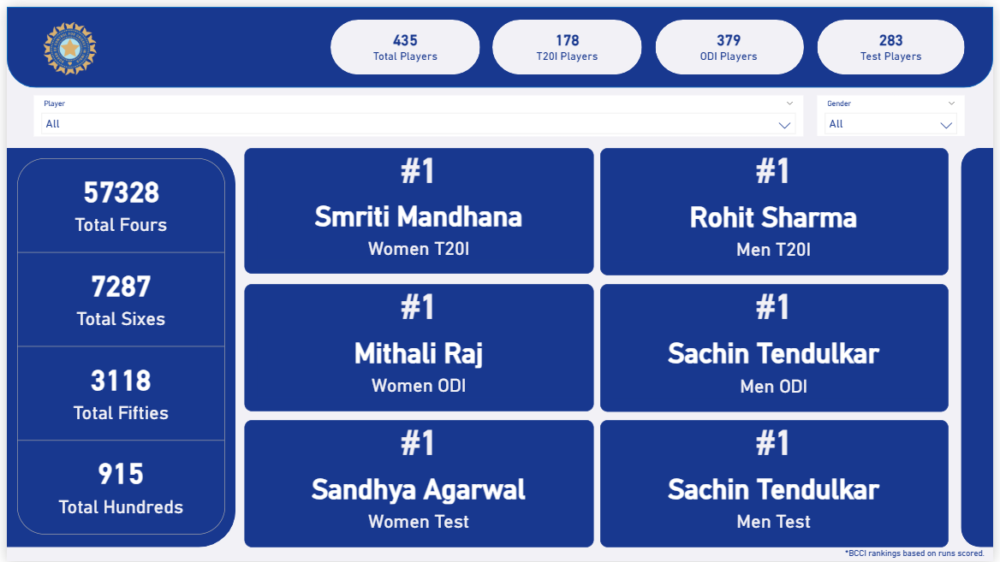
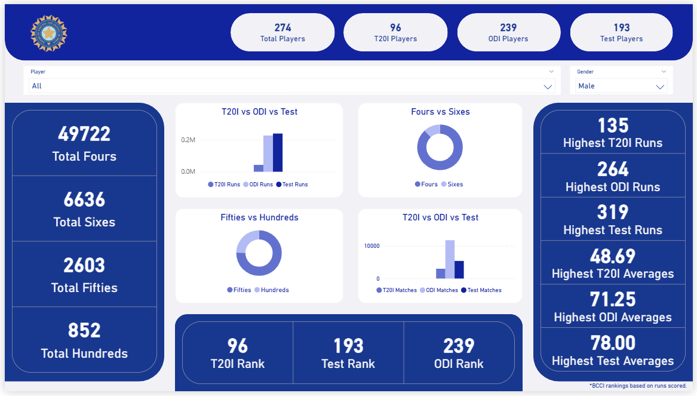
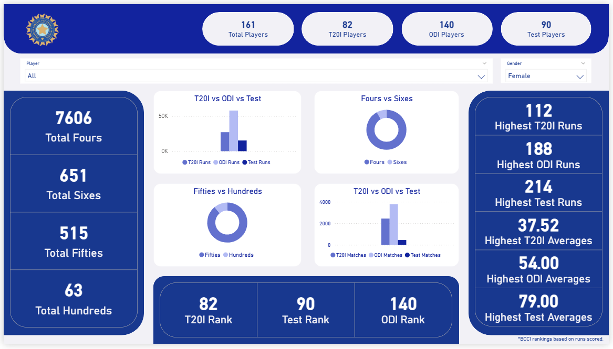
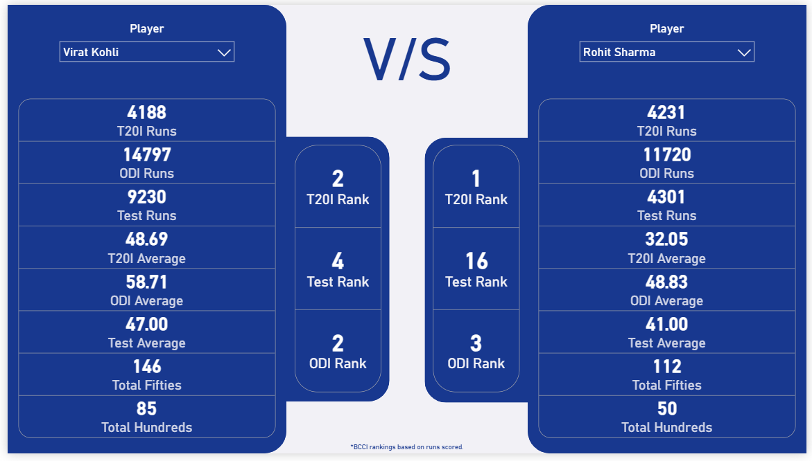
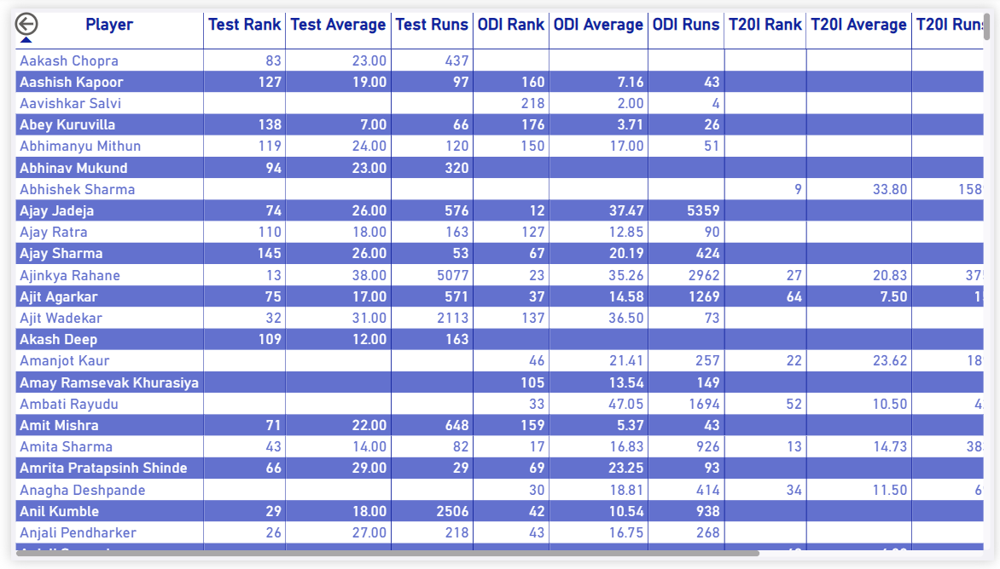

# Indian Cricket Analytics Dashboard

An end-to-end **Data Analytics** project that collects batting statistics from the **BCCI website**, processes the data using Python, stores it in **PostgreSQL**, and visualizes it through an interactive **Power BI dashboard**.

The project follows a complete **ETL (Extract, Transform, Load)** workflow and demonstrates how raw web data can be converted into meaningful business insights.

---

# Project Overview

This project analyzes the batting performance of Indian international cricketers across **Test**, **ODI**, and **T20I** formats for both **Men's** and **Women's** teams.

Instead of using a pre-built dataset, the data is collected directly from the official BCCI website using web scraping techniques, making the project dynamic and easy to update whenever player statistics change.

---

# Live Dashboard

Explore the interactive Power BI dashboard here:

**Live Dashboard:** [View Dashboard](https://app.powerbi.com/groups/me/reports/4fd2ace2-6140-434e-9cbf-4ba6429f30ea/4f89accfdc27702939ff?experience=power-bi)

> **Note:** The dashboard is best viewed on a desktop or laptop for the optimal interactive experience.

---

# Objectives

- Extract batting statistics from the official BCCI website.
- Clean and transform raw data into an analysis-ready format.
- Store cleaned data in PostgreSQL.
- Build an interactive Power BI dashboard.
- Compare player performance across different formats.
- Provide detailed player-level analysis using drill-through pages.

---

# Tools & Technologies

| Category | Tools |
|----------|-------|
| Programming | Python |
| Web Scraping | Requests, BeautifulSoup |
| Data Processing | Pandas, NumPy |
| Database | PostgreSQL |
| Visualization | Power BI |
| Query Language | SQL |
| IDE | Jupyter Notebook |

---

# Project Structure

```text
Indian_Cricket_Analytics/
│
├── Dashboard/
│   └── Player_Data_Analysis.pbix
|
├── Data_Cleaning/
|   └── Cleaned_CSV
│   |   ├── Clean_Men_ODI.csv
│   |   ├── Clean_Men_T20I.csv
│   |   ├── Clean_Men_Test.csv
│   |   ├── Clean_Women_ODI.csv
│   |   ├── Clean_Women_T20I.csv
│   |   └── Clean_Women_Test.csv
|   |
|   └── Cleaned_Python
│       ├── Men_ODI_Data_Cleaning.ipynb
│       ├── Men_T20I_Data_Cleaning.ipynb
│       ├── Men_Test_Data_Cleaning.ipynb
│       ├── Women_ODI_Data_Cleaning.ipynb
│       ├── Women_T20I_Data_Cleaning.ipynb
│       └── Women_Test_Data_Cleaning.ipynb
|
├── Data_Merging/
|   └── Merged_Python
│   |   ├── Player_Data.ipynb
|   |
|   └── Player_Data
│       ├── Player_Date.csv
│       └── Player_Name_Date.csv
|
├── Images/
|   └── Dashboard_Images
│   |   ├── 1._Cricket_Overview.png
│   |   ├── 2._Cricket_Men's_Overview.png
│   |   ├── 3._Cricket_Women's_Overview.png
│   |   ├── 4._Cricket_Player_Comparison.png
│   |   ├── 5._Cricket_Complete_Statistics.png
│   |   └── 6._Cricket_Player_Profile_(Drill_Through).png
|   |
|   └── Logo
│       ├── BCCI_Logo.webp

├── Web_Scraping/
|   └── Scraped_Data
│   |   ├── Men_ODI_Analysis.csv
│   |   ├── Men_T20I_Analysis.csv
│   |   ├── Men_Test_Analysis.csv
│   |   ├── Women_ODI_Analysis.csv
│   |   ├── Women_T20I_Analysis.csv
│   |   └── Women_Test_Analysis.csv
|   |
|   └── Scraping_Python
│       ├── Men_ODI_Analysis.ipynb
│       ├── Men_T20I_Analysis.ipynb
│       ├── Men_Test_Analysis.ipynb
│       ├── Women_ODI_Analysis.ipynb
│       ├── Women_T20I_Analysis.ipynb
│       └── Women_Test_Analysis.ipynb
│
└── README.md
```

---

# ETL Workflow

```text
BCCI Website
       │
       ▼
Extract
(Web Scraping using BeautifulSoup)
       │
       ▼
Raw CSV Files
       │
       ▼
Transform
(Data Cleaning & Processing using Pandas)
       │
       ▼
Clean CSV Files
       │
       ▼
Merge player statistics
       │
       ▼
Merged CSV file
       │
       ▼
Load
(PostgreSQL Database)
       │
       ▼
Power BI Dashboard
```

---

# Dashboard Features and Preview

The dashboard consists of **6 interactive pages** designed to provide both high-level and detailed player insights.

## Page 1 – Overview

- Overall project summary
- Top-ranked Men's and Women's batters


---

## Page 2 – Men's Analysis

- Test, ODI, and T20I batting statistics
- Player rankings
- Top performers
- Interactive charts
- Format-wise comparison


---

## Page 3 – Women's Analysis

- Women's batting performance
- Format-wise statistics
- Rankings
- Interactive visualizations


---

## Page 4 – Player Comparison

Compare two players side by side across all international formats.

Includes:

- Rankings
- Runs
- Matches
- Average
- Hundreds
- Fifties


---

## Page 5 – Statistics Table

Complete player statistics with interactive filtering and sorting.


---

## Page 6 – Player Profile (Drill Through)

Detailed analysis of an individual player including:

- Rankings
- Runs
- Average
- Matches
- Boundary statistics

.png)
---

# Key Features

- End-to-end ETL pipeline
- Data scraped directly from the official BCCI website
- Automated data cleaning using Pandas
- PostgreSQL integration
- Interactive Power BI dashboard
- Drill-through functionality
- Player comparison page
- Dynamic slicers and filters
- Responsive dashboard design

---

# Data Source

Official **BCCI Statistics Website**

https://www.bcci.tv/international

> **Note:** Player rankings shown in this dashboard are based on **BCCI batting runs** and are **not ICC international rankings**.

---

# Data Cleaning

The following preprocessing steps were performed:

- Removed unnecessary symbols
- Handled missing values
- Standardized column names
- Converted data types
- Cleaned player names
- Prepared separate datasets for each format
- Merged cleaned datasets for dashboard reporting

---

# Database

All cleaned datasets were imported into **PostgreSQL** for structured storage and efficient querying before connecting to Power BI.

---

# Power BI Highlights

- Interactive dashboard
- Drill-through pages
- DAX measures
- KPI Cards
- Dynamic filtering
- Player comparison
- Custom navigation
- Responsive layouts

---

# Learning Outcomes

Through this project, I gained practical experience in:

- Web scraping using BeautifulSoup
- Data cleaning with Pandas
- ETL pipeline development
- SQL and PostgreSQL
- Power BI dashboard design
- DAX calculations
- Data modeling
- Interactive dashboard development
- End-to-end analytics workflow

---
